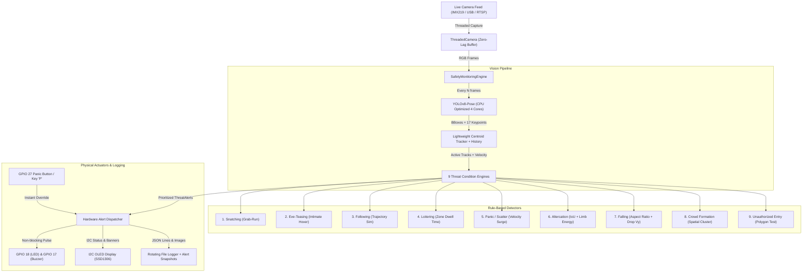

# Edge AI Safety Monitoring System for Raspberry Pi 5

A production-grade, multi-threaded AI vision surveillance and physical threat alerting system engineered for the **Raspberry Pi 5 (8GB RAM)** running **Debian 13 (Trixie)** on ARM64.

The system performs CPU-optimized inference using pre-trained **YOLOv8-pose** nano models combined with spatio-temporal trajectory tracking and geometric rule engines to detect 9 distinct physical safety threats in real-time, triggering physical GPIO LED strobes, active piezo buzzer sirens, and OLED status updates.

---

## 📑 Table of Contents
1. [System Architecture](#system-architecture)
2. [Project Structure](#project-structure)
3. [The 9 Detection Conditions & Reliability Analysis](#the-9-detection-conditions--reliability-analysis)
4. [Hardware Setup & Wiring](#hardware-setup--wiring)
5. [Installation on Debian 13 (Trixie)](#installation-on-debian-13-trixie)
6. [Configuration & Threshold Tuning](#configuration--threshold-tuning)
7. [Running the System](#running-the-system)
8. [Manual Panic Override & Logging](#manual-panic-override--logging)

---

## 1. System Architecture



---

## 2. Project Structure

```
Crime_Detection/
├── config/
│   ├── config.yaml            # Master configuration (thresholds, zones, GPIO pins)
│   └── config.json            # JSON format configuration mirror
├── src/
│   ├── __init__.py
│   ├── config_loader.py       # Configuration parser with defaults
│   ├── capture.py             # Non-blocking threaded camera capture (Picamera2/V4L2)
│   ├── logger.py              # Structured JSON logging & async snapshot recording
│   ├── engine.py              # Central pipeline orchestrator
│   ├── hardware/
│   │   ├── __init__.py
│   │   ├── gpio_alert.py      # gpiozero LED, Buzzer & Panic Button controller
│   │   └── oled_display.py    # SSD1306/SH1106 OLED status & alert banner renderer
│   ├── tracking/
│   │   ├── __init__.py
│   │   ├── tracker.py         # Multi-object tracker & trajectory history manager
│   │   └── spatial.py         # Polygon containment, IoU, velocity & cosine similarity math
│   └── detectors/
│       ├── __init__.py
│       ├── base_detector.py   # Base class and ThreatAlert dataclass
│       ├── snatching.py       # Condition 1: Approach-intercept-escape heuristic
│       ├── eve_teasing.py     # Condition 2: Personal space invasion heuristic
│       ├── following.py       # Condition 3: Trajectory cross-correlation & distance
│       ├── loitering.py       # Condition 4: Polygon zone dwell time
│       ├── panic_movement.py  # Condition 5: Speed surge & crowd scatter
│       ├── altercation.py     # Condition 6: Bounding box collision & kinetic energy
│       ├── falling.py         # Condition 7: Aspect ratio inversion & vertical drop
│       ├── crowd_formation.py # Condition 8: Spatial adjacency density clustering
│       └── unauthorized_entry.py # Condition 9: Restricted polygon boundary entry
├── tests/
│   ├── __init__.py
│   └── test_detectors.py      # Unit test suite for all 9 detectors
├── main.py                    # CLI application entrypoint
├── requirements.txt           # Python package dependencies
├── INSTALL_DEBIAN13.md        # Step-by-step Debian 13 Trixie setup guide
├── WIRING.md                  # Hardware pinout & wiring diagrams
└── README.md                  # System manual and documentation
```

---

## 3. The 9 Detection Conditions & Reliability Analysis

| # | Threat Condition | Detection Methodology | Reliability Tier | False-Positive Vulnerabilities & Mitigation |
|---|---|---|---|---|
| **1** | **Snatching** | **Heuristic**: Rapid approach $\rightarrow$ brief close proximity ($<1.5\text{s}$) $\rightarrow$ high-speed escape vector ($>220\text{px/s}$). | 🟡 **Heuristic** | *Risk*: Joggers passing closely by pedestrians.<br>*Mitigation*: Requires divergence angle shift and velocity acceleration ratio ($>1.4\times$). |
| **2** | **Eve-Teasing / Harassment** | **Heuristic**: Persistent intimate space intrusion ($<65\text{px}$ / $<0.8\text{m}$) sustained for $>3.5\text{s}$ without walking through. | 🟡 **Heuristic** | *Risk*: Friends/couples standing together in conversation.<br>*Mitigation*: Use as a soft alert or combine with camera zone filtering. |
| **3** | **Suspicious Following** | **Geometric Trajectory**: Cosine similarity ($>0.78$) of movement vectors over $>4.0\text{s}$ while follower maintains lagging distance ($40\text{--}180\text{px}$). | 🟢 **High** | *Risk*: Coincidental walking down a narrow hallway.<br>*Mitigation*: Requires minimum displacement ($>80\text{px}$) and directional dot-product confirmation. |
| **4** | **Loitering** | **Spatial Dwell**: Point-in-polygon containment timer triggering if dwell $> \text{threshold}$ (e.g. $10\text{s}$). | 🟢 **Very High** | *Risk*: Authorized staff standing in area.<br>*Mitigation*: Configure customized polygon zones in `config.yaml`. |
| **5** | **Panic Movement** | **Kinematic Surge**: Speed spike ($>200\text{px/s}$), erratic turns ($>70^\circ$), or simultaneous multi-person outward dispersal. | 🟢 **High** | *Risk*: Individual running to catch a bus.<br>*Mitigation*: Crowd scatter condition requires $\ge 3$ persons sprinting in divergent vectors. |
| **6** | **Physical Altercation** | **Collision + Pose**: Bounding box IoU overlap ($>0.15$) combined with high kinetic speed ($>150\text{px/s}$) and wrist/arm keypoint motion. | 🟢 **High** | *Risk*: Playful hugs or high-fives.<br>*Mitigation*: Requires sustained high-energy contact duration ($>1.0\text{s}$). |
| **7** | **Falling** | **Aspect Ratio + Pose**: BBox width/height flip ($W/H > 1.15$), downward vertical velocity ($v_y > 130\text{px/s}$), and horizontal torso pose angle ($<30^\circ$). | 🟢 **Very High** | *Risk*: Person bending down to tie shoe.<br>*Mitigation*: Downward velocity filter and ground-plane altitude boundary. |
| **8** | **Unusual Crowd Formation** | **Spatial Clustering**: Connected components graph clustering finding $\ge N$ people within spatial radius. | 🟢 **Very High** | *Risk*: Normal queues or public transit arrival.<br>*Mitigation*: Adjustable minimum cluster size and distance threshold. |
| **9** | **Unauthorized Entry** | **Polygon Containment**: Immediate ray-casting test for person centroid/feet inside high-security perimeter. | 🟢 **Deterministic (100%)** | *Risk*: Sensor occlusions or inaccurate polygon boundary.<br>*Mitigation*: Precise coordinate calibration in `config.yaml`. |

---

## 4. Hardware Setup & Wiring

See [WIRING.md](file:///d:/Hackviz/Crime_Detection/WIRING.md) for full schematics.

- **Alert LED**: GPIO 18 (Pin 12) $\rightarrow$ 220Ω Resistor $\rightarrow$ Anode (+) \| Cathode (-) $\rightarrow$ GND (Pin 14)
- **Piezo Buzzer**: GPIO 17 (Pin 11) $\rightarrow$ Positive (+) \| Negative (-) $\rightarrow$ GND (Pin 9)
- **Panic Button**: GPIO 27 (Pin 13) $\rightarrow$ Button Terminal 1 \| Terminal 2 $\rightarrow$ GND (Pin 20)
- **OLED Display (I2C1)**: VCC $\rightarrow$ 3.3V (Pin 1), GND $\rightarrow$ GND (Pin 6), SDA $\rightarrow$ GPIO 2 (Pin 3), SCL $\rightarrow$ GPIO 3 (Pin 5)

---

## 5. Installation on Debian 13 (Trixie)

See [INSTALL_DEBIAN13.md](file:///d:/Hackviz/Crime_Detection/INSTALL_DEBIAN13.md) for full setup instructions.

```bash
# 1. Update OS and install system libraries
sudo apt update && sudo apt install -y python3-pip python3-venv i2c-tools v4l-utils libgpiod2 python3-lgpio

# 2. Configure IMX219 camera in /boot/firmware/config.txt:
# dtoverlay=imx219,cam0
# dtparam=i2c_arm=on

# 3. Create virtual environment (Debian 13 PEP 668 compliance)
python3 -m venv venv --system-site-packages
source venv/bin/activate

# 4. Install dependencies
pip install -r requirements.txt
```

---

## 6. Configuration & Threshold Tuning

All parameters are customizable in `config/config.yaml`:

### Tuning Detection Sensitivity
- **Loitering time**: Adjust `detectors.loitering.dwell_time_threshold` (default: `10.0` seconds).
- **Following duration**: Adjust `detectors.suspicious_following.min_tracking_duration` (default: `4.0` seconds) and `trajectory_similarity` (default: `0.78`).
- **Falling sensitivity**: Adjust `detectors.falling.aspect_ratio_threshold` (default: `1.15`).
- **Restricted Zones**: Edit polygons `[[x1, y1], [x2, y2], [x3, y3], [x4, y4]]` under `detectors.unauthorized_entry.zones`.

### Optimizing CPU Performance on Raspberry Pi 5
- `inference.frame_skip`: Set to `2` or `3` to run YOLO on every 2nd or 3rd frame while tracking smoothly on intermediate frames.
- `camera.width` & `camera.height`: Default `640x480` delivers optimal trade-off between range and CPU throughput (10–14 FPS on 4 cores).

---

## 7. Running the System

```bash
# Run with live IMX219 / default camera with GUI preview
python main.py

# Run in background Headless Mode (no GUI window)
python main.py --headless

# Run on a recorded video file
python main.py --source /path/to/test_video.mp4

# Run in Mock Hardware mode (off-Pi testing without GPIO/OLED)
python main.py --mock-hardware

# Run Automated Test Suite
python -m unittest discover -s tests -p "test_*.py"
```

---

## 8. Manual Panic Override & Logging

- **Physical Button**: Press the button connected to **GPIO 27** at any time to immediately trigger a `CRITICAL` priority siren and LED strobe.
- **Keyboard Shortcut**: Press **`P`** in the GUI preview window for an instant software panic trigger. Press **`Q`** to exit cleanly.
- **Logs**: All detection events and panic triggers are recorded in `logs/safety_monitor.log`. High-priority alert snapshot images are automatically saved to `logs/snapshots/`.
# Crime_Detection_for_Women_Safety

